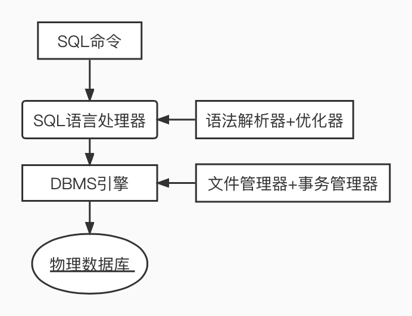

[基础教学](http://c.biancheng.net/sql/what-is-sql.html)

## 什么是SQL？

- SQL 是 Structured Query Language 的缩写，是一种结构化查询语言(操作数据库的语言)

- SQL 是一种被 ANSI 标准化的计算机语言(ANSI, 美国国家标准化组织)

  <!-- more -->

## SQL的用途

- 允许用户访问关系型数据库系统中的数据(查询)
- 允许用户可从数据库中取出数据
- 允许用户插入新数据(INSERT)
- 允许用户更新数据库中的数据(UPDATE)
- 允许用户从数据库中删除数据(DELETE)
- 允许用户创建新的数据库(CREATE DATABASE)
- 允许用户在数据库中创建新表(CREATE TABLE)
- 允许用户在数据库中创建存储过程
- 允许用户在数据库中创建视图、函数
- 允许用户设置对表、存储过程和视图的权限

## SQL体系结构



## RDBMS

[DBMS和RDBMS的区别](https://www.nhooo.com/note/qa04wc.html)

DBMS 代表 数据库管理系统。RDBMS 指的是 关系型数据库管理系统。

DBMS用于创建/更新/删除和维护数据库，并提供对数据的受控访问。关系数据库管理系统RDBMS是DBMS的增强版本。

RDBMS是 SQL 语言以及所有现代数据库系统（例如 SQL Server、DB2、Oracle、MySQL 和 Microsoft Access）的基础。

RDBMS 中的数据存储在被称为表（table）的数据库对象中。且表（table）是相关的数据项的集合，它由列和行组成。

## DDL(数据定义语言)🌟🌟🌟

对数据的结构和形式进行定义，一般用于数据库和表的创建、删除、修改等。

- CREATE DATABASE - 创建新数据库

  ```sql
  CREATE DATABASE 数据库名字;
  ```

- ALTER DATABASE - 修改数据库

  ```sql
  ALTER DATABASE 数据库名字
  ```

- DROP DATABASE - 删除数据库

  ```sql
  DROP TABLE 数据库名字;
  ```

- CREATE TABLE - 创建新表

  ```sql
  CREATE TABLE 表名(
  字段名1 数据类型,
  字段名2 数据类型,
  .....
  字段名N 数据类型,
  PRIMARY KEY( one or more columns )
  );
  ```

- ALTER TABLE - 变更数据库表

  ```sql
  -- 在表中添加列
  ALTER TABLE 表名 ADD 列名 指定列表数据类型;
  -- 在表中删除列
  ALTER TABLE 表名 DROP COLUMN 列表字段名;
  -- 改变表中的数据类型
  ALTER TABLE 表名 ALTER COLUMN 列表字段名 修改的新列表数据类型;
  -- 改变列名
  ALTER TABLE 表名 CHANGE 旧列名 新列名;
  ```

- DROP TABLE - 删除表

  ```sql
  DROP TABLE 表名
  ```

- CREATE INDEX - 创建索引（搜索键）

  ```sql
  CREATE UNIQUE INDEX 下标名 ON 表名 ( column1, column2,...columnN);
  ```

- DROP INDEX -删除索引

  ```sql
  --Microsoft SQLjet
  DROP INDEX 索引名 ON 表名；
  
  --MS SQL Sever
  DROP INDEX 表名.下标名；
  
  --IBM DB2 和 Oracle 语法
  DROP INDEX 下标名；
  
  --MySQL 
  ALTER TABLE 表名 DROP INDEX 下标名；
  ```

## DML (数据处理语言)

对数据库中的数据进行处理，一般用于数据项（记录）的插入、删除、修改和查询。

- SELECT - 从数据库中查询（选取）数据

  ```sql
  -- 获取全量数据
  SELECT * FROM 表名
  -- 获取个别字段数据
  SELECT 字段名 FROM 表名
  -- 去重获取
  SELECT DISTINCT 字段名 FROM 表名
  ```

- UPDATE  - 用于更新数据库中的数据

  ```sql
  -- 更新指定的值
  UPDATE 表名 SET 字段名 = 新的值 WHERE 字段名 = 设定的值;
  -- 更新一行里多个值
  UPDATE 表明 SET 字段名1 = 新的值1, 字段名2 = 新的值2 WHERE 字段名 = 设定的值;
  ```

- DELETE - 从数据库中删除数据

  ```sql
  -- 删除所有
  DELETE FROM 表名;
  -- 删除指定行
  DELETE FROM 表名 WHERE 字段名 = 值;
  -- 删除不属于条件下的值
  DELETE FROM 表名 WHERE 字段名 IS NOT 数值;
  
  ```

- INSERT INTO - 向数据库表中插入数据

  ```sql
  -- 全字段添加
  INSERT INTO 表名 VALUES (值1，值2，值3，...);
  -- 指定字段添加
  INSERT INTO 表名 (字段1，字段2，...) VALUES (值1，值2，...);
  
  ```
  
  

## SQL语法

### where 子句

使用 SQL 从单个表或者多表联合查询数据时，可以使用 **WHERE** 子句指定查询条件

```sql
SELECT 字段名1, 字段名2
FROM 表名
WHERE 条件 (字段名 运算符 值)
```

### AND 运算符

AND 运算符用于连接 WHERE 子句中的多个查询条件，只有当这些查询条件都被满足时（取交集），数据行（记录）才会被选取

```sql
SELECT * FROM 表名 WHERE 条件1 AND 条件2
```

### OR 运算符

OR 运算符用于连接 WHERE 子句中的多个查询条件，只要满足其中一个条件（取并集），数据行（记录）就能被选取

```sql
SELECT * FROM 表名 WHERE 条件1 OR 条件2
```

### ORDER BY 语句

**ORDER BY** 子句用于根据一个或者多个字段对查询结果（结果集）进行排序，可以是降序，也可以是升序。默认升序

```sql
SELECT * FROM 表名 ORDER BY 字段名 （ ASC or DESC ）
```

### USE 语句

USE语句用于选择SQL架构中的任何现有数据库

```sql
USE 数据库名字
```

