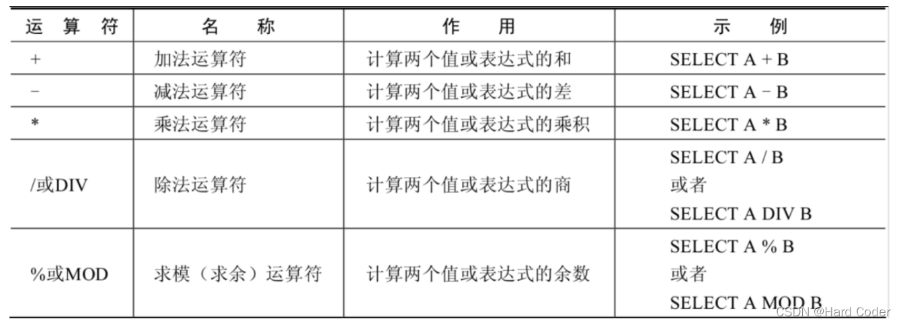
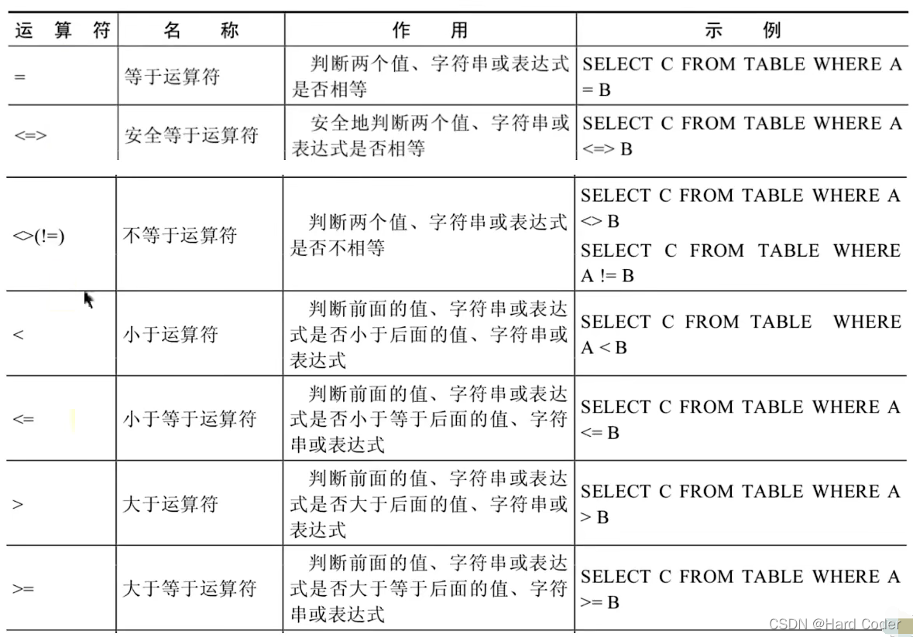
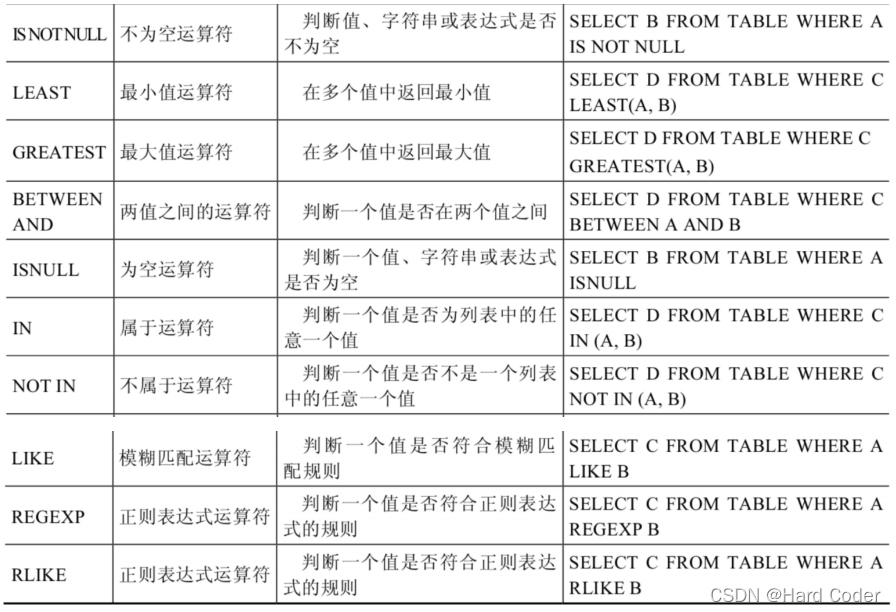

###  Top语句

用于返回指定数量的数据量，对于数据量很大的表中查询配合Top语句更有效率。[TOP用法](https://www.cnblogs.com/LEPENGYANG/p/14050317.html)

⚠️不是所有的数据库系统都支持Top语句。例：MySQL ，用于MySQL可以用LIMIT来限定

```sql
-- 返回确定数目的记录个数
SELECT TOP 个数 <列名表> FROM 表名 [查询条件]
-- 返回结果集中指定百分比的记录数
SELECT TOP 百分数 PERCENT <列名表> FROM <表名> [查询条件]
```

<!-- more -->

### LIKE语句

**LIKE** 子句用于在 WHERE 语句中进行模糊匹配

#### **通配符**

```sql
-- % 匹配零个、一个或者多个任意的字符
SELECT * FROM 表名 WHERE 字段名 LIKE "%a"；
-- _ 匹配单个字符或者数字
SELECT * FROM 表名 WHERE 字段名 LIKE "_a"；
```

### IN语句

可以在 where 子句中查询多个规定的值

```sql
SELECT 字段 FROM 表名 WHERE 字段 in (值1,值2);
```

### BETWEEN操作符

在where 子句中，作用是选取介于两个值之间的数据范围

```sql
SELECT * FROM 表名 WHERE 字段名 BETWEEN 值1 AND 值2；
```

### ALIAS 别名

```sql
SELECT * FROM 表名 AS 表别名；
-- 或
SELECT * FROM 表名 表别名；
```

### 运算符

[运算符具体例子](https://blog.csdn.net/qq_44111805/article/details/124403278)

#### 算术运算符

对数值或表达式进行加（+）、减（-）、乘（*）、除（/）和取余（%）运算

⚠️在MySQL中+只表示数值相加。如果遇到非数值类型，先尝试转成数值，如果转失败，就按0计算。且 null值参与运算，结果为null

#### 比较运算符

比较运算符用来对表达式左边的操作数和右边的操作数进行比较，比较的结果为真则返回1，比较的结果为假则返回0，其他情况则返回NULL。比较运算符经常被用来作为SELECT查询语句的条件来使用，返回符合条件的结果记录。

#### 非符号运算符



⚠️非空运算符（IS NOT NULL）判断一个值是否不为NULL，如果不为NULL则返回1，否则返回0
